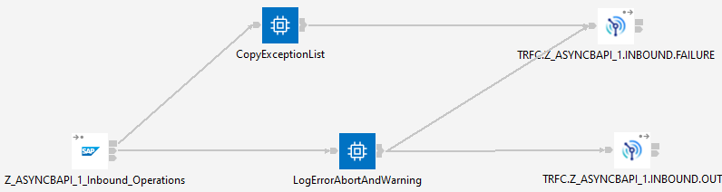
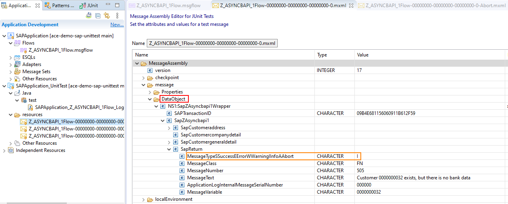

# ace-demo-sap-unittest

This repo contains artifacts that demonstrate the ability of App Connect Enterprise (ACE) 
v12 to test flows using SAP Input nodes without needing an actual SAP system to be available. 
The main prereq is the ACE v12 product, which can be downloaded from 
[the IBM website](https://www.ibm.com/marketing/iwm/iwm/web/pickUrxNew.do?source=swg-wmbfd).

## Background

Testing integration flows is often complicated by the need to provide valid input messages
to start the flow off, and this task is itself complicated by the varied protocols and transports
found in many integration scenarios. At one end of the spectrum, REST-over-HTTP is a fairly 
standard protocol (at least at a high level) and commodity tools exist to provide test drivers, 
sample data, etc, while other systems are much harder to work with.

This repo shows how to test flows using one of the harder input nodes: SAP is hugely powerful
and widely used, but is not readily available on developer laptops with all the customisation
applied by SAP customers for their own businesses, and therefore running regression tests on
integration flows usually requires an actual SAP system to drive the SAP Input node; the tests
in this repo, on the other hand, run correctly without needing SAP at all.

## Demo application

The demo application is based on an actual regression test that has been used in App Connect 
Enterprise testing, and is designed to show how to validate the ESQL in the LogErrorAbortAndWarning
Compute node without needing SAP itself. The Compute node will propagate to the "out1" terminal 
and on to the TRFC.Z_ASYNCBAPI_1.INBOUND.FAILURE MQ Output node to record the failure if the incoming
message is marked as being an error, abort, or warning message. In the other cases, it will propagate
to the "out" terminal and on to the TRFC.Z_ASYNCBAPI_1.INBOUND.OUT node.



While the flow appears simple, it is complicated to test without using the ACE v12 test support code. The 
original test flows, on which this application is based, used an actual SAP system to provide input to the 
SAP Input node.

## Messages used in the tests

The messages used in the tests are based on a message recorded from one of the internal ACE test system 
runs, and then modified to allow for Compute node testing. The server used in the internal tests was configured
to record all messages going through all flows, and this created the initial message data. Although this
was done for an internal test system, the recording of messages is fully-supported and can be used to 
capture messages for any flows. Instructions for enabling the recording are in the
[how to record messages](https://www.ibm.com/docs/en/app-connect/12.0?topic=flow-configuring-integration-server-record-messages)
section of the ACE v12 documentation.

For more extensive testing, more messages were needed, and the ACE v12 toolkit provides an easy way to 
edit recorded messages. For the tests in this repo, two new copies were made of an initial message, and
then modified to change the MessageTypeSSuccessEErrorWWarningIInfoAAbort field. Double-clicking on the 
mxml messages brings up the message assembly editor, showing important information such as the message
domain (DataObject in this case, as it should be for the SAP Input node), and the editor also allows the
various fields to be changed



The orange box around the MessageTypeSSuccessEErrorWWarningIInfoAAbort field shows the data to be changed,
with an "E" and an "A" representing Error and Abort respectively; the resource files in the test project
have suffixes to show the letter that has been changed.

## Test structure

The tests are constructed to load a specific test message, call the Compute node, and validate that the 
correct terminal is used to send the message on. They use NodeSpy objects to check the terminal and also
the outgoing message.

## Test runtime 

The tests will run without SAP or an MQ queue manager; the ACE v12 server is told not to start the message 
flows, so no connections will be attempted. The test commands can be seen in the 
[Maven configuration](SAPApplication_UnitTest/pom.xml) in the test project, with the critical elements being 
the command-line options "--mq-queue-manager-name dummy" and "--start-msgflows false":

```
IntegrationServer -w /tmp/mvn-test-work-dir --mq-queue-manager-name dummy --start-msgflows false --no-nodejs --admin-rest-api -1 --test-project SAPApplication_UnitTest
```

The toolkit uses the same options to achieve the same goal: the tests can run without prerequisite services
being available.

## How to get started

To try this demo out using the ACE toolkit:

1) Clone this repo using the ACE v12 toolkit Git perspective
2) Right-click on "SAPApplication_UnitTest" and select "Run Test Project"; this should successfully run the JUnit tests.
3) Optionally, inspect the test source and recorded messages.

The demo can also be run (on Linux) from the command line; after cloning the repo, run "mvn verify" to build and run 
the tests using Maven.

